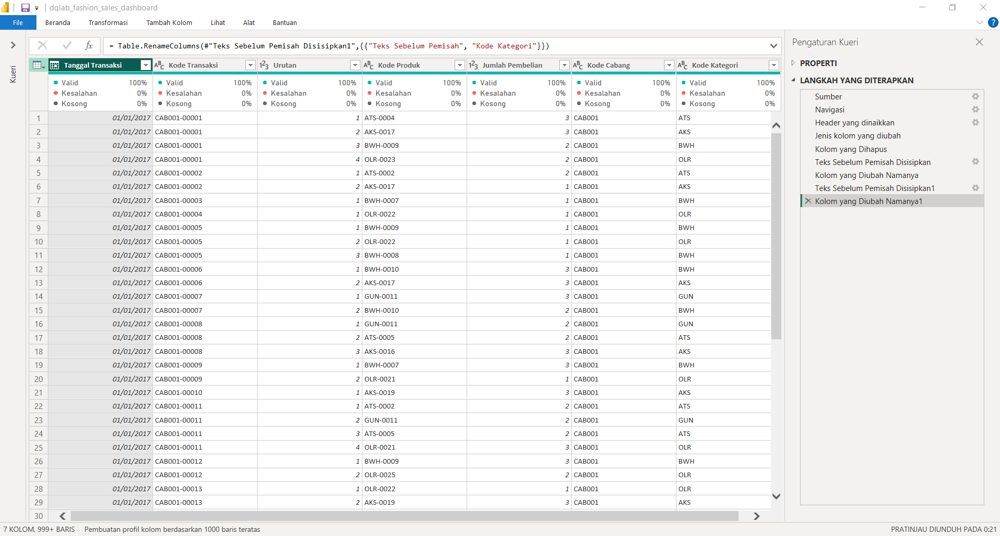
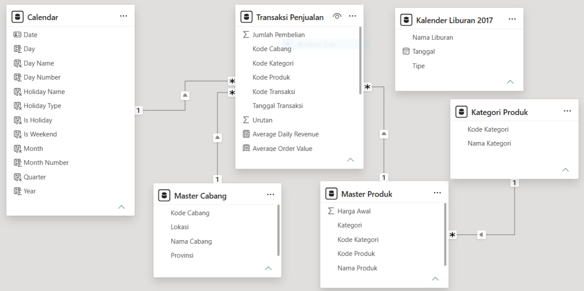
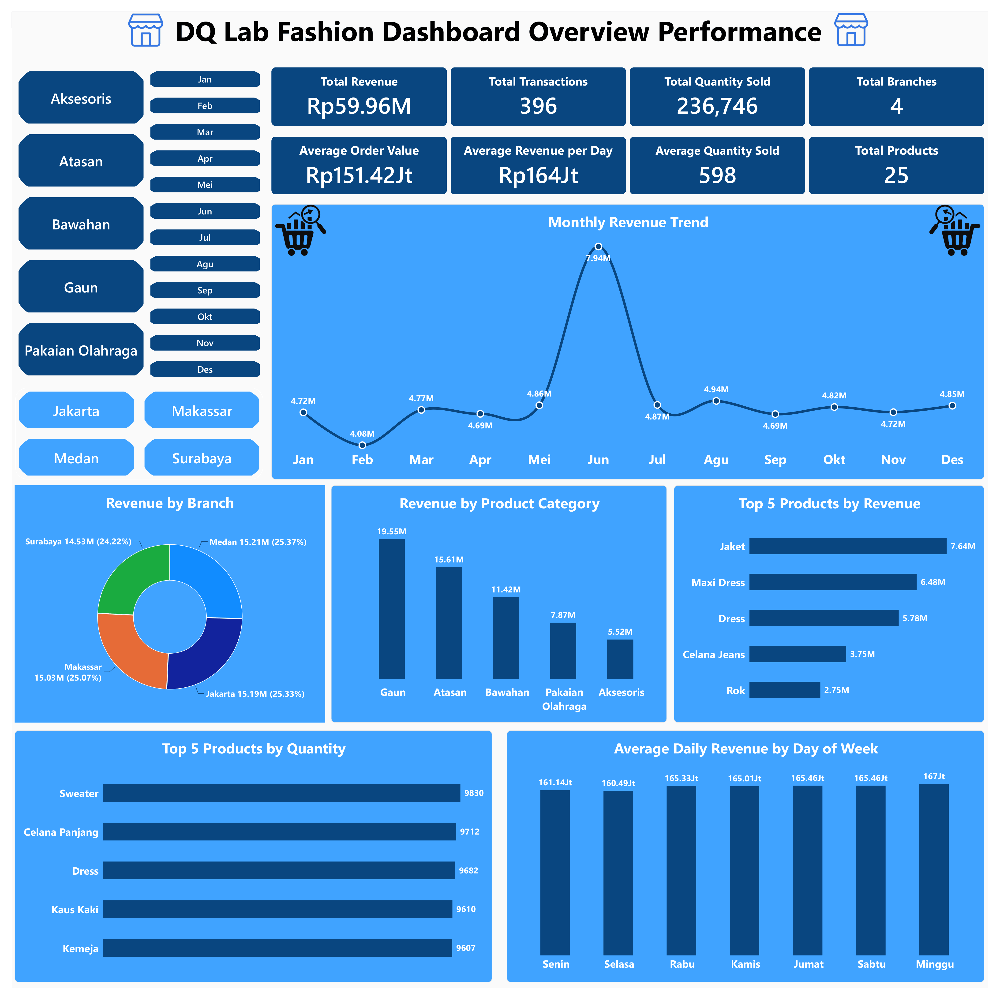
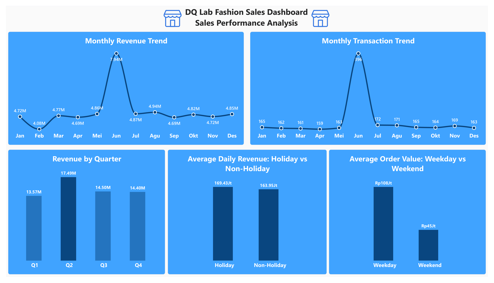
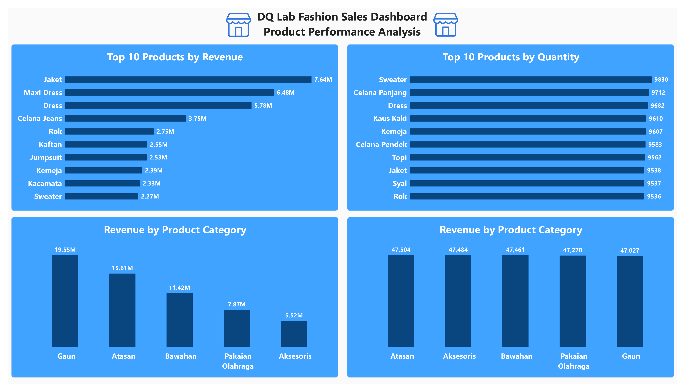
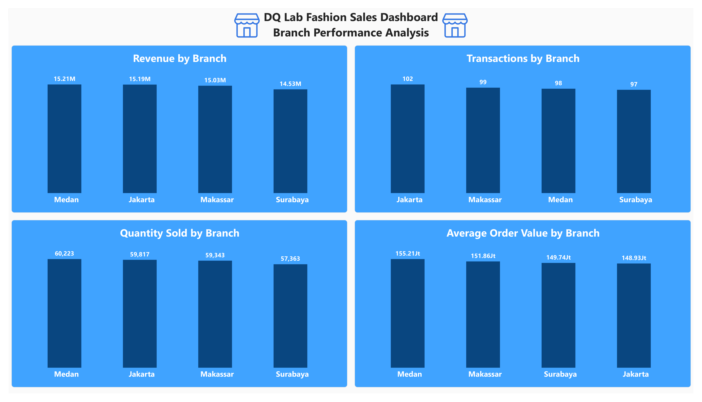

# DQLab Fashion Sales Performance Dashboard

End-to-end sales analytics project developed using **Microsoft Power BI** to analyze fashion retail performance across time, products, categories, branches, and calendar-based business conditions.

The project covers data transformation, relational data modeling, DAX measure development, interactive dashboard creation, and business insight generation.

---

## Project Overview

This project analyzes fashion retail transaction data from **2017** to understand overall sales performance and identify key business patterns across products, categories, branches, and time periods.

Power BI was used to transform the raw Excel dataset, build a relational data model, create DAX measures, and develop multiple interactive report pages for business analysis.

The analysis focuses on four main areas:

- Dashboard Overview
- Sales Performance
- Product Performance
- Branch Performance

Additional calendar attributes were also used to analyze sales behavior across weekdays, weekends, holidays, months, and quarters.

---

## Business Objectives

The project aims to answer several business questions:

- How does overall sales performance develop throughout the year?
- Which months and quarters generate the strongest revenue?
- Which products and categories contribute the most to sales?
- Which products generate the highest unit sales?
- How does business performance differ across branches?
- Which branches generate the highest revenue and transaction volume?
- How does sales behavior differ between weekdays and weekends?
- How does sales performance behave during holidays and non-holidays?

---

## Dataset

The project uses an Excel source containing five primary raw datasets.

| Dataset | Description |
|---|---|
| `Transaksi Penjualan` | Transaction date, transaction code, product code, item sequence, and purchase quantity |
| `Master Cabang` | Branch code, branch name, location, and province |
| `Master Produk` | Product code, category, product name, and initial price |
| `Kategori Produk` | Product category code and category name |
| `Kalender Liburan 2017` | Holiday date, holiday name, and holiday type |

A separate **Calendar table** was developed in Power BI to support time intelligence and calendar-based analysis.

The Calendar table contains:

`Date` • `Day` • `Day Name` • `Day Number` • `Month` • `Month Number` • `Quarter` • `Year` • `Is Weekend` • `Is Holiday` • `Holiday Name` • `Holiday Type`

---

## Analysis Workflow

```text
Raw Excel Dataset
        ↓
Power Query
Data Cleaning & Transformation
        ↓
Calendar & Supporting Tables
        ↓
Power BI Data Model
Relationships Between Tables
        ↓
DAX Measures
Business KPI Development
        ↓
Interactive Report Pages
        ↓
Business Insights
```

---

## Data Transformation with Power Query

Power Query was used to transform and prepare the source data before analysis.

The transformation process included:

- Standardizing column names and data types
- Preparing transaction and master tables
- Extracting branch information from transaction identifiers
- Preparing product category information
- Validating data consistency
- Creating analysis-ready tables
- Preparing fields used for relational modeling



---

## Data Modeling

A relational data model was developed to connect transaction data with product, branch, category, and calendar information.



The main relationships include:

- `Calendar[Date]` → `Transaksi Penjualan[Tanggal Transaksi]`
- `Master Cabang[Kode Cabang]` → `Transaksi Penjualan[Kode Cabang]`
- `Master Produk[Kode Produk]` → `Transaksi Penjualan[Kode Produk]`
- `Kategori Produk[Kode Kategori]` → `Master Produk[Kode Kategori]`

`Transaksi Penjualan` acts as the main fact table, while the supporting tables provide descriptive dimensions for time, products, categories, and branches.

This structure allows business metrics to be analyzed consistently across multiple dimensions.

---

## DAX Measures

Several DAX measures were created to support KPI calculations and report analysis.

| Measure | Purpose |
|---|---|
| Total Revenue | Calculates total sales revenue |
| Total Transactions | Counts unique transactions |
| Total Quantity Sold | Calculates total product units sold |
| Total Products | Counts unique products sold |
| Total Branches | Counts active branches |
| Average Order Value | Calculates average revenue per transaction |
| Average Quantity Sold | Calculates average units sold per transaction |
| Average Daily Revenue | Calculates average revenue generated per day |

### Total Revenue

```DAX
Total Revenue = 
SUMX('Transaksi Penjualan','Transaksi Penjualan'[Jumlah Pembelian] * RELATED('Master Produk'[Harga Awal]))
```

### Total Transactions

```DAX
Total Transactions = 
DISTINCTCOUNT('Transaksi Penjualan'[Kode Transaksi])
```

### Total Quantity Sold

```DAX
Total Quantity Sold = 
SUM('Transaksi Penjualan'[Jumlah Pembelian])
```

### Average Order Value

```DAX
Average Order Value = 
DIVIDE([Total Revenue],[Total Transactions])
```

### Average Quantity Sold

```DAX
Average Quantity Sold = 
DIVIDE([Total Quantity Sold],[Total Transactions], 0)
```

### Average Daily Revenue

```DAX
Average Daily Revenue = 
AVERAGEX(VALUES('Calendar'[Date]), [Total Revenue])
```

These measures provide reusable calculation logic across all report pages and filters.

---

# Dashboard Overview

The Dashboard Overview provides a high-level summary of business performance through KPI cards and selected visualizations.



The dashboard combines:

- Overall revenue performance
- Transaction volume
- Quantity sold
- Average order performance
- Monthly revenue trend
- Product category contribution
- Top-performing products
- Branch performance
- Average daily revenue by day of week

Interactive slicers allow users to explore performance by month, product category, and branch.

---

# Sales Performance



The Sales Performance page focuses on how business performance changes over time.

The analysis includes:

- Monthly Revenue Trend
- Monthly Transaction Trend
- Quarterly Revenue Performance
- Average Daily Revenue: Holiday vs Non-Holiday Performance
- Average Order Value: Weekday vs Weekend Performance

Calendar-based analysis makes it possible to evaluate whether different types of days are associated with changes in sales behavior.

Using **average daily revenue** rather than only total revenue also creates a fairer comparison between groups with different numbers of calendar days.

---

# Product Performance



Product analysis evaluates performance from both revenue and sales-volume perspectives.

The analysis includes:

- Top 10 Products by Revenue
- Top 10 Products by Quantity Sold
- Revenue by Product Category
- Quantity Sold by Product Category

This distinction is important because the product generating the highest revenue is not necessarily the product with the highest unit sales.

The analysis shows that product contribution varies significantly across both individual products and fashion categories.

---

# Branch Performance



The Branch Performance page compares performance across:

- Cabang Jakarta
- Cabang Surabaya
- Cabang Medan
- Cabang Makasar

The analysis evaluates:

- Revenue by Branch
- Transactions by Branch
- Quantity Sold by Branch
- Average Order Value by Branch

Comparing multiple metrics provides a more complete view of branch performance than revenue alone.

For example, a branch may lead in revenue while another branch performs better in average transaction value or transaction volume.

---

# Key Insights

- Monthly revenue performance varies throughout the year, with a noticeable peak during one of the mid-year periods.
- Revenue contribution is relatively distributed across the four operating branches.
- Product category performance differs significantly, indicating that some categories contribute substantially more revenue than others.
- High-revenue products are not always identical to products with the highest unit sales.
- Calendar-based analysis provides additional context for understanding sales differences across weekdays, weekends, holidays, and non-holidays.
- Branch performance should be evaluated using multiple indicators including revenue, transaction volume, quantity sold, and average order value.

---

# Business Recommendations

### Strengthen High-Performing Product Categories

Prioritize inventory availability and promotional activities for categories that consistently generate strong revenue.

Product decisions should consider both revenue contribution and unit sales to avoid relying on only one performance indicator.

### Monitor High-Volume Products

Products with high unit sales should receive sufficient inventory support to minimize the risk of stock shortages during periods of stronger demand.

### Optimize Branch-Level Strategy

Compare branch performance using revenue, transaction volume, quantity sold, and average order value.

This allows management to identify whether performance differences are caused by customer volume, purchasing value, or product demand.

### Use Calendar Patterns for Planning

Use weekday, weekend, and holiday performance patterns to support promotional planning, staffing, and inventory allocation.

### Monitor Monthly Sales Changes

Periods with unusual increases or decreases in revenue should be investigated further to understand whether changes are associated with seasonality, holidays, product demand, or branch performance.

---

## Skills Demonstrated

**Power BI • Power Query • DAX • Data Cleaning • Data Transformation • Data Modeling • Star Schema • Table Relationships • Calendar Table • Time Intelligence • KPI Development • Sales Analysis • Product Analysis • Branch Analysis • Holiday Analysis • Dashboard Development • Business Insights • Data Storytelling**

---

## Project Structure

```text
dqlab-fashion-sales-dashboard/
│
├── README.md
│
├── data/
│   ├── README.md
│   └── dqlab_fashion_raw_data.xlsx
│
├── powerbi/
│   ├── README.md
│   └── dqlab_fashion_sales_dashboard.pbix
│
└── images/
    ├── README.md
    ├── 01_dashboard_overview.png
    ├── 02_sales_performance.png
    ├── 03_product_performance.png
    ├── 04_branch_performance.png
    ├── 05_data_modeling.png
    └── 06_power_query_transformation.png
